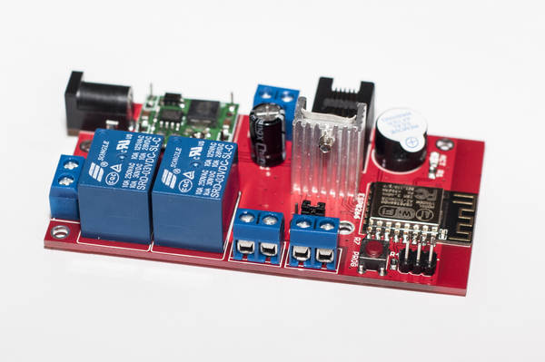

# ESP8266 Incubator PCB
Design of ESP8266 incubator PCB.

## Features

  * Powered by mini DC-DC power supply module ([LM2596](http://www.ti.com/lit/ds/symlink/lm2596.pdf) chip).
  * 5.5 mm center positive jack.
  * On-board programming connector.
  * Programming push button.
  * Jumper for enabling power supply module.
  * RJ-11 connector for connecting various sensors.
  * Notification LED.
  * Intended to be manufactured by [dirtypcbs.com](http://dirtypcbs.com/).
  * AVR like ISP header for in circuit programming.
  * Two relays in series for driving heater circuit.
  * Two screw terminals for connecting heaters.
  * 12V screw terminal for controlling fan.
  * Piezo buzzer for alarm signaling.